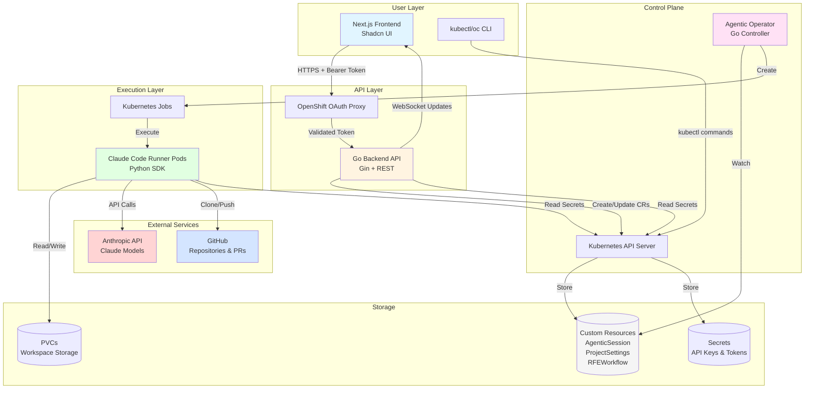
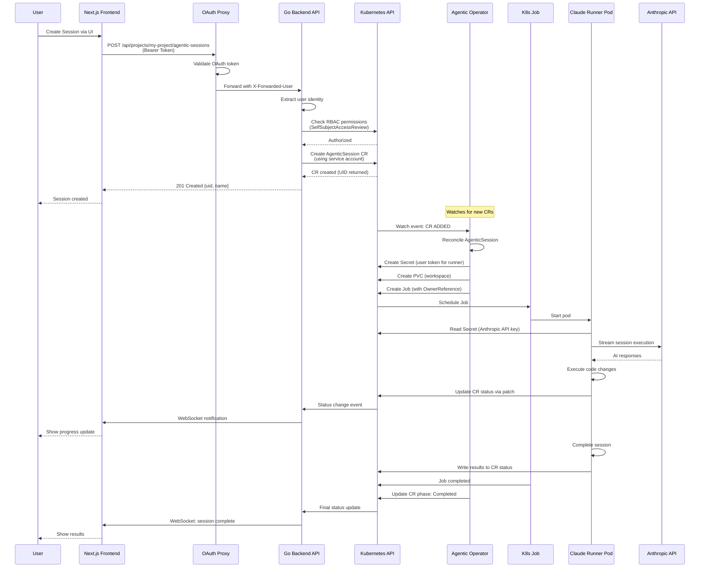
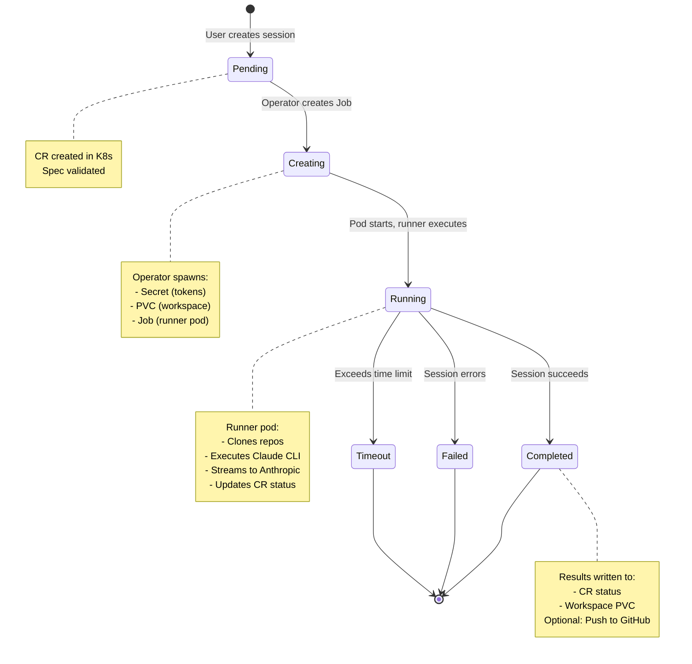
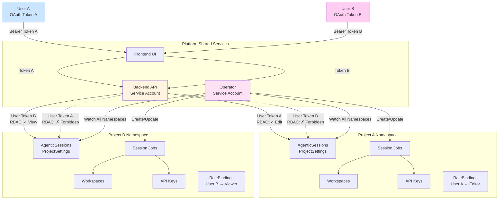
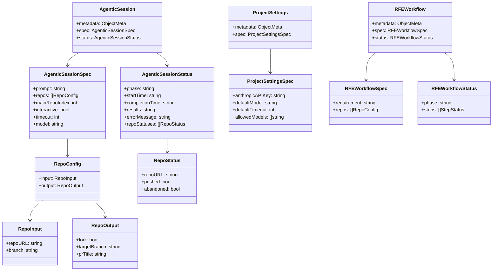
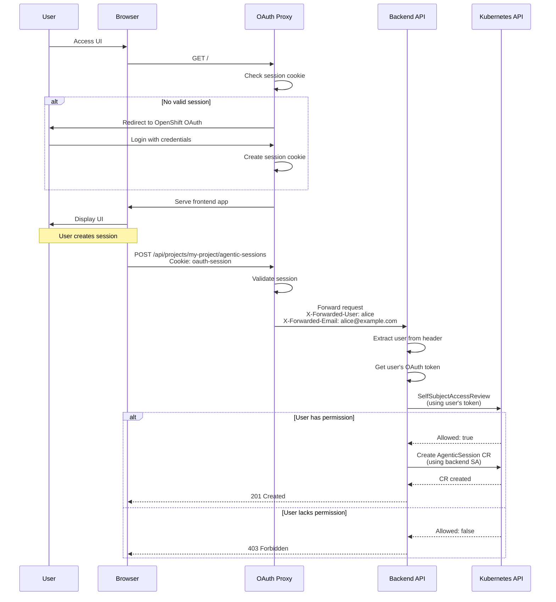
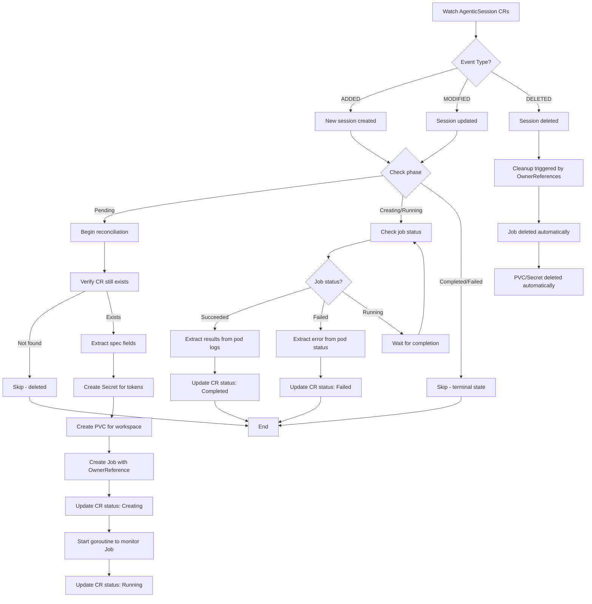
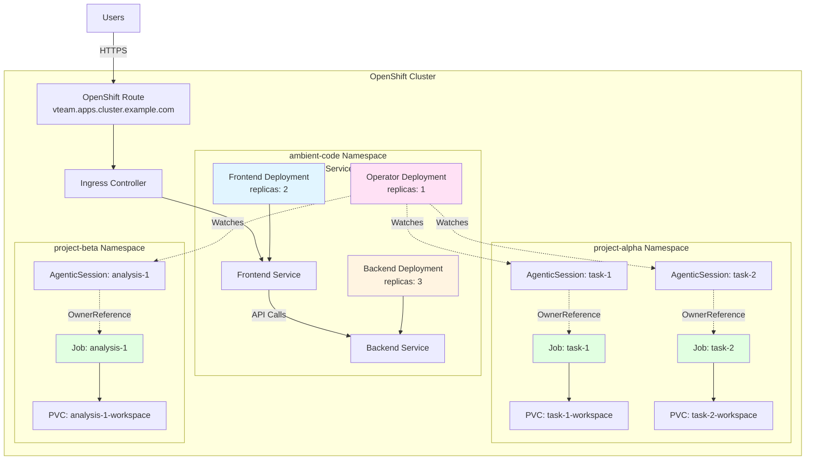
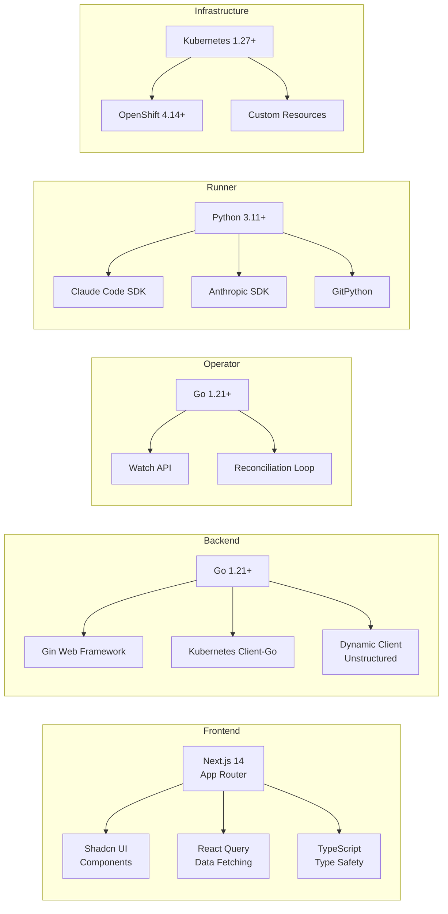

# Ambient Code Platform Architecture Diagrams

This document provides visual representations of the Ambient Code Platform architecture, component interactions, and key workflows.

## System Architecture Overview

## Component Interaction Flow

## Agentic Session Lifecycle

## Multi-Tenant Architecture

## Custom Resource Definitions Structure

## Authentication and Authorization Flow

## Operator Reconciliation Pattern

## Data Flow: Session Creation to Completion

```mermaid
graph LR
    subgraph "1. User Request"
        A[User submits<br/>session request]
    end

    subgraph "2. API Processing"
        B[Backend validates<br/>request]
        C[Backend checks<br/>RBAC]
        D[Backend creates<br/>CR]
    end

    subgraph "3. Operator Reconciliation"
        E[Operator detects<br/>new CR]
        F[Create<br/>infrastructure]
        G[Spawn Job]
    end

    subgraph "4. Runner Execution"
        H[Runner pod<br/>starts]
        I[Clone repos]
        J[Execute Claude<br/>session]
        K[Apply changes]
    end

    subgraph "5. Results"
        L[Update CR<br/>status]
        M[Persist to<br/>workspace]
        N[Optional: Push<br/>to GitHub]
    end

    subgraph "6. User Visibility"
        O[WebSocket<br/>notifications]
        P[UI displays<br/>results]
    end

    A --> B
    B --> C
    C --> D
    D --> E
    E --> F
    F --> G
    G --> H
    H --> I
    I --> J
    J --> K
    K --> L
    L --> M
    M --> N
    L --> O
    O --> P

    style A fill:#e1f5ff
    style D fill:#fff4e1
    style G fill:#ffe1f5
    style J fill:#e1ffe1
    style L fill:#f5f5f5
    style P fill:#e1f5ff
```

## Component Deployment Topology

## Technology Stack

## Key Design Patterns

### 1. Kubernetes-Native Pattern
- **Custom Resources** represent desired state
- **Operator** reconciles actual state to desired state
- **OwnerReferences** enable automatic cleanup
- **Namespaces** provide multi-tenant isolation

### 2. Security Pattern
- **User Token Authentication**: Backend uses user's OAuth token for RBAC checks
- **Service Account for Writes**: Backend SA writes CRs after validation
- **Runner Token**: Operator mints temporary tokens for runner pods
- **Secret Management**: API keys stored in Kubernetes Secrets

### 3. Scalability Pattern
- **Stateless Components**: Frontend and Backend scale horizontally
- **Job-Based Execution**: Each session is an isolated Kubernetes Job
- **Resource Limits**: Jobs have CPU/memory limits to prevent resource exhaustion
- **Namespace Isolation**: Projects in separate namespaces prevent interference

### 4. Observability Pattern
- **CR Status**: Single source of truth for session state
- **Kubernetes Events**: Operator emits events for debugging
- **WebSocket Updates**: Real-time notifications to UI
- **Structured Logging**: JSON logs with correlation IDs

## Related Documentation

- [ADR-0001: Kubernetes-Native Architecture](../adr/0001-kubernetes-native-architecture.md)
- [ADR-0002: User Token Authentication](../adr/0002-user-token-authentication.md)
- [ADR-0003: Multi-Repo Support](../adr/0003-multi-repo-support.md)
- [Amber Workflow Diagrams](amber-workflow.md)
- [Getting Started Guide](../user-guide/getting-started.md)
