# Ambient Code Platform Architecture

This document provides comprehensive architecture diagrams for the Ambient Code Platform, showing system components, data flows, and integration points.

## System Overview

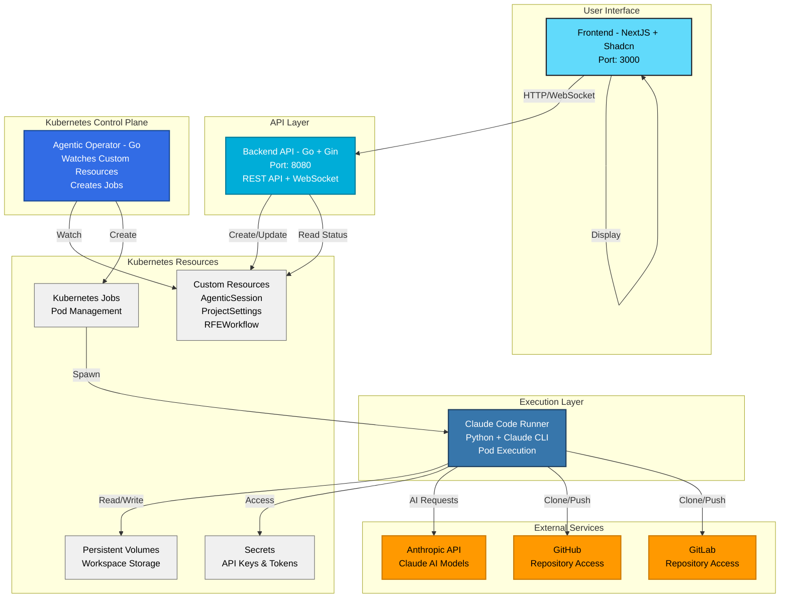

## Agentic Session Lifecycle

This diagram shows the complete lifecycle of an agentic session from creation to completion.

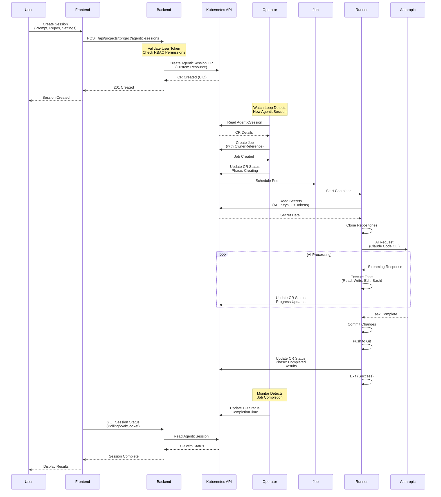

## Component Architecture

### Frontend (NextJS + Shadcn UI)

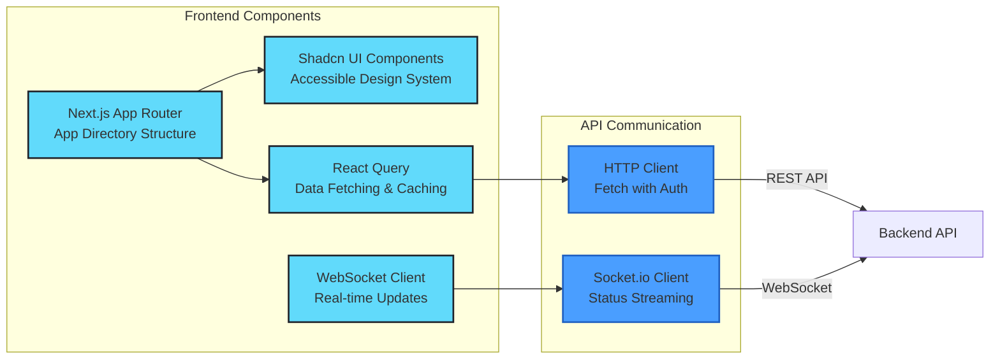

### Backend API (Go + Gin)

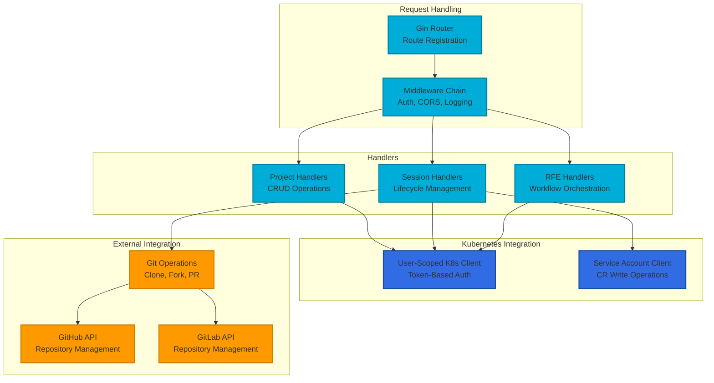

### Agentic Operator (Go)

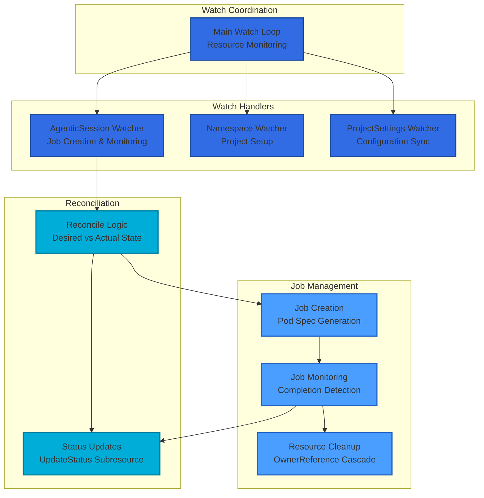

### Claude Code Runner (Python)

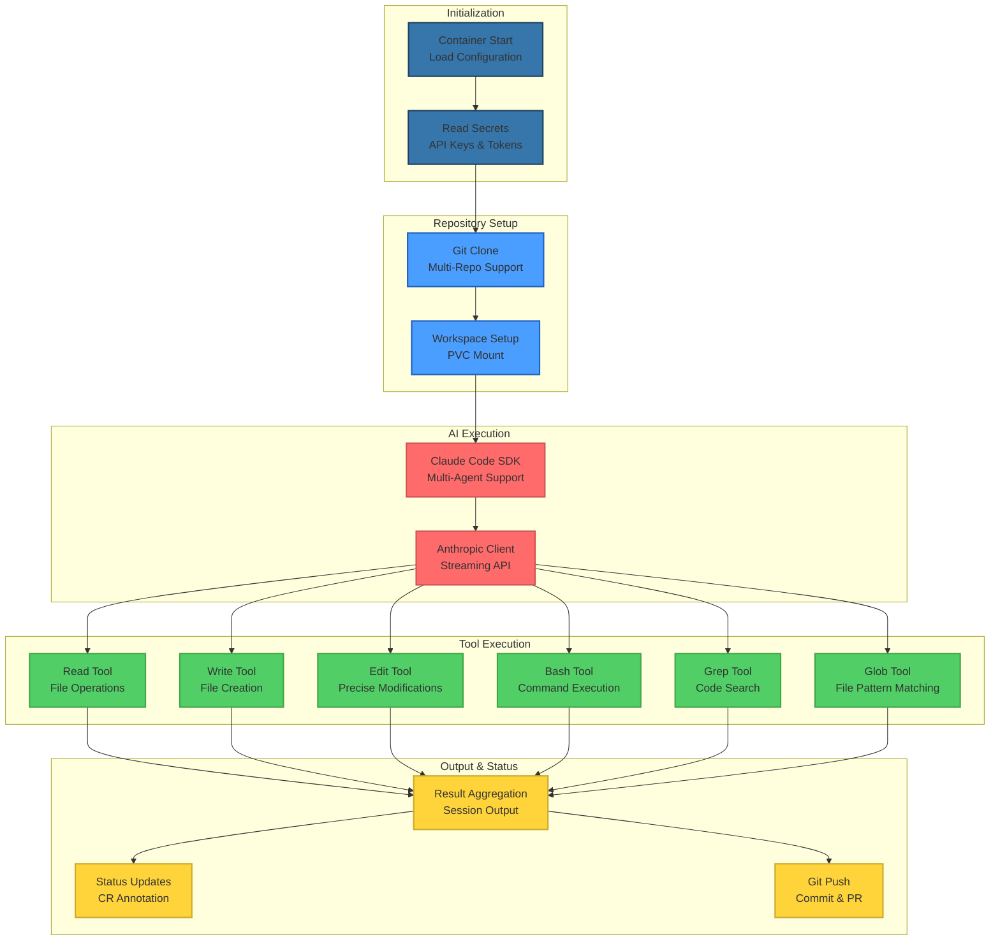

## Data Flow Architecture

### Session Creation Flow

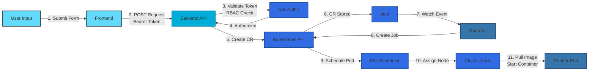

### Authentication & Authorization Flow

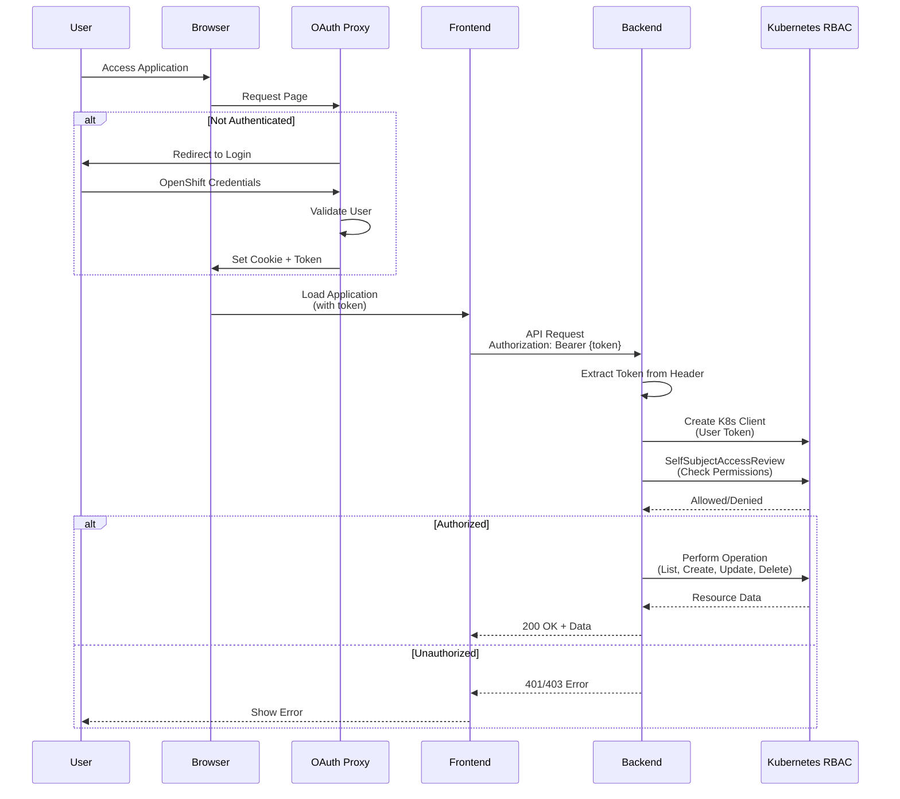

## Multi-Tenancy Architecture

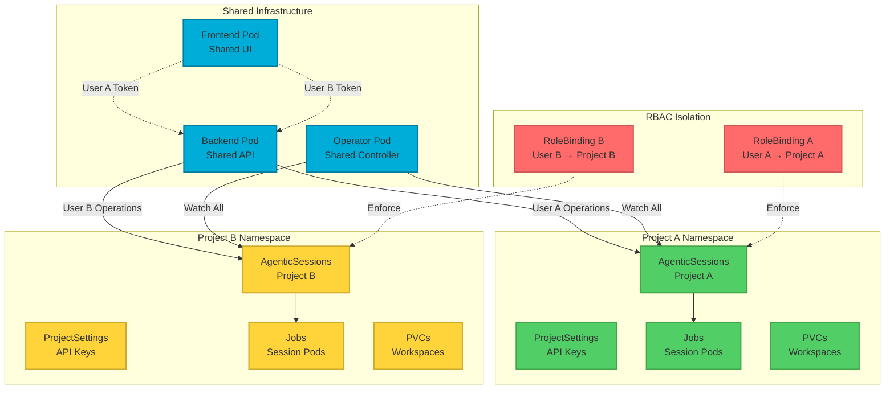

## Deployment Architecture

### Development Environment (OpenShift Local)

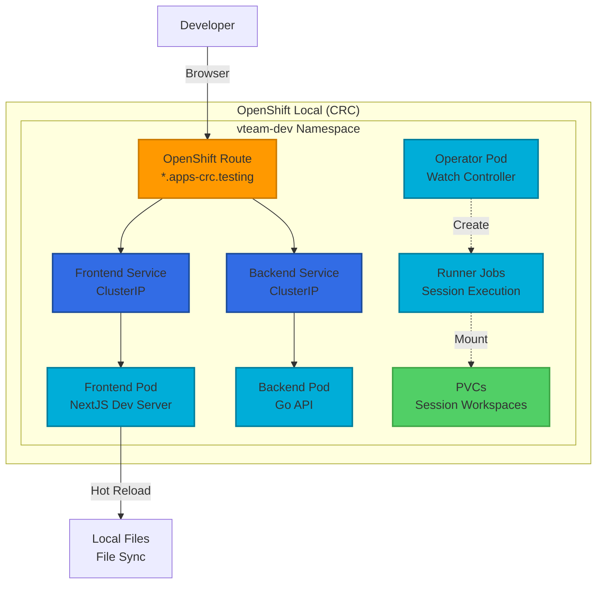

### Production Environment (OpenShift Cluster)

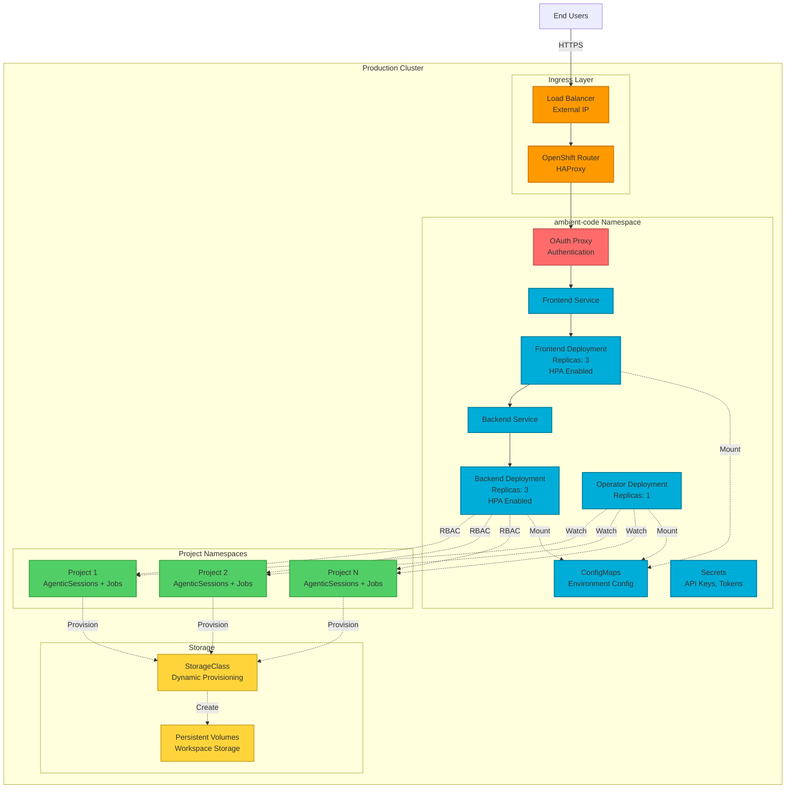

## Key Architectural Principles

### 1. Kubernetes-Native Design

- **Custom Resource Definitions (CRDs)**: AgenticSession, ProjectSettings, RFEWorkflow
- **Operator Pattern**: Reconciliation loop watches for CR changes
- **Job-based Execution**: Stateless runner pods for AI tasks
- **OwnerReferences**: Automatic resource cleanup via Kubernetes garbage collection

### 2. Security-First Architecture

- **User Token Authentication**: All API operations use user's Kubernetes token
- **RBAC Enforcement**: Namespace-scoped permissions via RoleBindings
- **Service Account Isolation**: Backend service account only for CR write operations
- **Secret Management**: Kubernetes Secrets for API keys and Git tokens

### 3. Multi-Tenancy

- **Project-based Isolation**: Each project maps to a Kubernetes namespace
- **Resource Quotas**: Per-namespace CPU/memory limits
- **Network Policies**: Component isolation and secure communication
- **Audit Logging**: Track all user operations

### 4. Scalability & Performance

- **Horizontal Pod Autoscaling**: Frontend and Backend scale with load
- **Concurrent Job Execution**: Multiple sessions run in parallel
- **Resource Limits**: Proper requests/limits for optimal scheduling
- **WebSocket Streaming**: Real-time status updates without polling

### 5. Extensibility

- **Multi-Agent Support**: Claude Code SDK enables specialized agents
- **Multi-Repo Sessions**: Operate on multiple repositories simultaneously
- **Custom Workflows**: RFE workflows orchestrate multi-step processes
- **Provider Agnostic**: GitHub and GitLab support with extensible design

## Component Communication

### Protocol Matrix

| Source | Target | Protocol | Port | Purpose |
|--------|--------|----------|------|---------|
| Frontend | Backend | HTTP/HTTPS | 8080 | REST API calls |
| Frontend | Backend | WebSocket | 8080 | Real-time status updates |
| Backend | Kubernetes API | HTTPS | 6443 | CR operations (user token) |
| Backend | Kubernetes API | HTTPS | 6443 | CR write (service account) |
| Operator | Kubernetes API | HTTPS | 6443 | Watch CRs, Create Jobs |
| Runner | Anthropic API | HTTPS | 443 | AI model inference |
| Runner | GitHub API | HTTPS | 443 | Repository operations |
| Runner | GitLab API | HTTPS | 443 | Repository operations |
| User | Frontend | HTTPS | 443 | Browser access |

### Network Topology

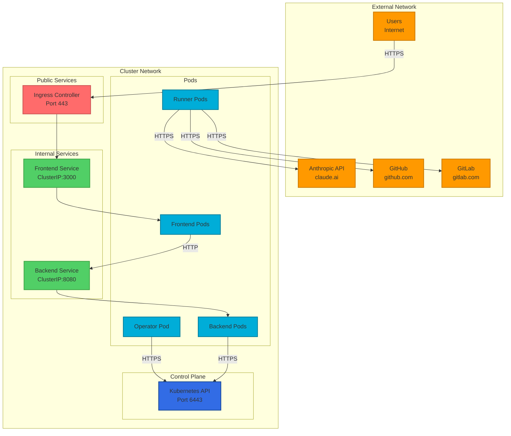

## Related Documentation

- [CLAUDE.md](../../CLAUDE.md) - Development standards and patterns
- [README.md](../../README.md) - Project overview and quick start
- [ADR-0001: Kubernetes-Native Architecture](../adr/0001-kubernetes-native-architecture.md)
- [ADR-0002: User Token Authentication](../adr/0002-user-token-authentication.md)
- [Backend Development Context](../../.claude/context/backend-development.md)
- [Frontend Development Context](../../.claude/context/frontend-development.md)
